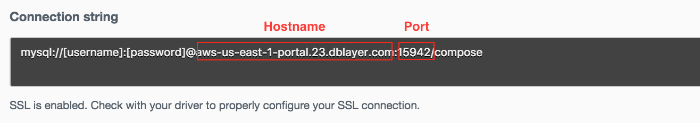

[](https://travis-ci.org/IBM/Scalable-WordPress-deployment-on-Kubernetes)

*他の言語で表示: [English](README.md) / [한국어](README-ko.md) / [português](README-po.md).*

# スケーラブルな WordPress 実装を Kubernetes クラスター上にデプロイする

このチュートリアルでは、Kubernetesクラスタの全機能を紹介し、世界で最も人気のあるWebサイトフレームワークを世界で最も人気のあるコンテナ・オーケストレーションプラットフォーム上に展開する方法を紹介します。KubernetesクラスタでWordPressをホストするための完全なロードマップを提供します。各コンポーネントは別々のコンテナまたはコンテナのグループで実行されます。

Wordpressは典型的な多層アプリケーションを表し、各コンポーネントはそれぞれのコンテナを持ちます。WordPressコンテナはフロントエンド層となり、MySQLコンテナはWordPressのデータベース/バックエンド層になります。

Kubernetesへのデプロイに加えて、フロントのWordPress層をどのように拡張できるか、そしてMySQLをIBM Cloudからのサービスとして仕様してWordPressフロントエンドで使用する方法も説明します。


## Included Components
- [WordPress (最新版)](https://hub.docker.com/_/wordpress/)
- [MySQL (5.6)](https://hub.docker.com/_/mysql/)
- [Kubernetes Clusters](https://cloud.ibm.com/docs/containers/cs_ov.html#cs_ov)
- [IBM Cloud Compose for MySQL](https://cloud.ibm.com/catalog/services/compose-for-mysql)
- [IBM Cloud DevOps Toolchain Service](https://cloud.ibm.com/catalog/services/continuous-delivery)
- [IBM Cloud Kubernetes Service](https://cloud.ibm.com/catalog?taxonomyNavigation=apps&category=containers)

## 前提条件

ローカルテスト用の[Minikube](https://kubernetes.io/docs/setup/minikube/)や、[IBM Cloud Kubernetes Service](https://github.com/IBM/container-journey-template)または[IBM Cloud Private](https://github.com/IBM/deploy-ibm-cloud-private/blob/master/README.md) のいずれかでKubernetes Clusterを作成します。このレポジトリのコードは[Kubernetes Cluster from IBM Cloud Container Service](https://cloud.ibm.com/docs/containers/cs_ov.html#cs_ov)上でTravis CIを使用して定期的にテストされています。

## 目的

このシナリオでは、以下の作業について説明します:

- 永続ディスクを定義するためローカル永続ボリュームを作成
- 機密データを保護するためのシークレットを作成
- WordPressフロントエンドのポットを1つ以上作成してデプロイ
- MySQLデータベースを作成してデプロイします。(コンテナ内、またはバックエンドとしてIBM CloudのMySQLを使用)

## Deploy to IBM Cloud
WordPressを直接IBM Cloudへデプロイしたい場合は、下の`Deploy to IBM Cloud`ボタンをクリックしてWordPressサンプルをデプロイするためのIBM Cloud DepOps サービスツールチェインとパイプラインを作成します。それ以外の場合は、[手順](##手順)へジャンプします

[](https://cloud.ibm.com/devops/getting-started)

ツールチェインとパイプラインを完成させるには、 [Toolchain instructions](https://github.com/IBM/container-journey-template/blob/master/Toolchain_Instructions_new.md) の指示に従ってください。

## 手順
1. [MySQL シークレットの設定](#1-mysql-シークレットの設定)
2. [ローカル永続ボリュームの作成](#2-ローカル永続ボリュームの作成)
3. [WordPressとMySQLのサービス/デプロイメントの作成と配布](#3-WordPressとMySQLのサービス/デプロイメントの作成と配布)
  - 3.1 [コンテナ内でMySQLを使用する](#31-コンテナ内でMySQLを使用する)
  - 3.2 [バックエンドとしてIBM Cloud MySQLを使用する](#32-バックエンドとしてIBM-Cloud-MySQLを使用する)
4. [外部のWordPressリンクにアクセする](#4-外部のWordPressリンクにアクセする)
5. [WordPressを使用する](#5-WordPressを使用する)

# 1. MySQL シークレットの設定

> *Quickstart option:* このレポジトリ内で `bash scripts/quickstart.sh`を実行します。

同じディレクトリに`password.txt`という名前の新しいファイルを作成し、希望のMySQLパスワードを`password.txt`の中に入れます。 (ASCII文字を含む任意の文字列).


`password.txt`の末尾に改行が無いことを確認する必要があります。改行を削除するには、次のコマンドを使用します。
```bash
tr -d '\n' <password.txt >.strippedpassword.txt && mv .strippedpassword.txt password.txt
```

# 2. ローカル永続ボリュームの作成
Kubernetesポッドのライフサイクルを超えてデータを保存するには、MySQLおよびWordPressアプリケーションが接続するための永続的なボリュームを作成する必要があります。

#### IBM Cloud Kubernetes Service "ライト"クラスタ
次のコマンドを実行して、ローカル永続ボリュームを手動で作成します
```bash
kubectl create -f local-volumes.yaml
```
#### IBM Cloud Kubernetes Service "有料"クラスタ または Minikube
MySQLおよびWordPressアプリケーションがデプロイされると、永続ボリュームが動的に作成されます。この手順は不要です

# 3. WordPressとMySQLのサービス/デプロイメントの作成と配布

### 3.1 コンテナ内でMySQLを使用する

> *Note:* IBM Cloud Compose-MySQLをバックエンドとして使用したい場合は、[バックエンドとしてIBM Cloud MySQLを使用する](#32-バックエンドとしてIBM-Cloud-MySQLを使用する)を参照してください

永続ボリュームをクラスタのローカルストレージにインストールします。その後、MySQLとWordPressのためのシークレットとサービスを作成します
```bash
kubectl create secret generic mysql-pass --from-file=password.txt
kubectl create -f mysql-deployment.yaml
kubectl create -f wordpress-deployment.yaml
```


すべてのポッドが実行されたら、次のコマンドを実行してポッド名を確認します。
```bash
kubectl get pods
```

これにより、Kubernetesクラスタからのポッドのリストが返されます
```bash
NAME                               READY     STATUS    RESTARTS   AGE
wordpress-3772071710-58mmd         1/1       Running   0          17s
wordpress-mysql-2569670970-bd07b   1/1       Running   0          1m
```

それでは、[外部のWordPressリンクにアクセスする](#-4-外部のWordPressリンクにアクセスする)へ進んでください

### 3.2 バックエンドとしてIBM Cloud MySQLを使用する

IBM CloudでCompose for MySQLをプロビジョニングします https://cloud.ibm.com/catalog/services/compose-for-mysql

サービス認証情報に移動して、認証情報を確認してください。
MySQLのホスト名、ポート番号、ユーザー、パスワードがあなたの認証情報URIの下にあり、以下のように見えるはずです



`wordpress-deployment.yaml`ファイルを編集し、WORDPRESS_DB_HOSTの値をMySQLのホスト名とポート番号に変更し(例： `value: <hostname>:<port>`)、 WORDPRESS_DB_USERの値をMySQLパスワードに変更します

環境変数は次のようになります

```yaml
    spec:
      containers:
      - image: wordpress:4.7.3-apache
        name: wordpress
        env:
        - name: WORDPRESS_DB_HOST
          value: sl-us-dal-9-portal.7.dblayer.com:22412
        - name: WORDPRESS_DB_USER
          value: admin
        - name: WORDPRESS_DB_PASSWORD
          value: XMRXTOXTDWOOPXEE
```

`wordpress-deployment.yaml`を変更したら、次のコマンドを実行してWordPressをデプロイします
```bash
kubectl create -f wordpress-deployment.yaml
```

すべてのポッドが実行されたら、次のコマンドを実行してポッド名を確認します
```bash
kubectl get pods
```

これにより、Kubernetesクラスタからポッドのリストが返されます

```bash
NAME                               READY     STATUS    RESTARTS   AGE
wordpress-3772071710-58mmd         1/1       Running   0          17s
```

# 4. 外部のWordPressリンクにアクセスする

> 有料クラスタがある場合は、NodePortの代わりにLoadBalancerを使用することができます。
>
>`kubectl edit services wordpress`
>
> `spec`の下で、 `type: NodePort` を `type: LoadBalancer` に変更してください
>
> **Note:** YAMLファイルを編集したあとに、`service "wordpress" edited`が表示されていることを確認してください。これはYAMLファイルが入力ミスや接続エラーなしで正常に編集されたことを意味します。

クラスタのIPアドレスを取得するには

```bash
$ bx cs workers <your_cluster_name>
OK
ID                                                 Public IP        Private IP     Machine Type   State    Status
kube-hou02-pa817264f1244245d38c4de72fffd527ca-w1   169.47.220.142   10.10.10.57    free           normal   Ready
```

NodePort番号を取得するには、次のコマンドを実行する必要があります。

```bash
$ kubectl get svc wordpress
NAME        CLUSTER-IP    EXTERNAL-IP   PORT(S)        AGE
wordpress   10.10.10.57   <nodes>       80:30180/TCP   2m
```

おめでとうございます。今あなたはあなたのWordPressサイトへアクセスするためのリンク**http://[IP]:[port number]** を使用することができるようになりました。


> **Note:** 上記の例では、リンクは次のようになります http://169.47.220.142:30180

Kubernetes UIでdeploymentのステータスを確認することができます。`kubectl proxy`を実行し、URL 'http://127.0.0.1:8001/ui'に移動して、WordPressコンテナの準備が整ったことを確認します。


> **Note:** ポッドが完全に機能するまで最大5分かかります。


**(Optional)** クラスタ内にさらにリソースがあり、WordPress Webサイトをスケールアップしたい場合は、次のコマンドを実行して現在のdeploymentsを確認できます。

```bash
$ kubectl get deployments
NAME              DESIRED   CURRENT   UP-TO-DATE   AVAILABLE   AGE
wordpress         1         1         1            1           23h
wordpress-mysql   1         1         1            1           23h
```

これで、次のコマンドを実行してWordPressフロントエンドをスケールアップできます。
```bash
$ kubectl scale deployments/wordpress --replicas=2
deployment "wordpress" scaled
$ kubectl get deployments
NAME              DESIRED   CURRENT   UP-TO-DATE   AVAILABLE   AGE
wordpress         2         2         2            2           23h
wordpress-mysql   1         1         1            1           23h
```
ご覧のとおり、WordPressフロントエンドを実行している2つのポッドがあります。

> **Note:** 無料クラスタユーザーの場合、無料利用枠のユーザーには限られたリソースしかないため、スケールアップは最大10個のポッドまでとすることをおすすめします。

# 5. WordPressを使用する

WordPressが起動しました。新しいユーザーとして登録して、WordPressをインストールすることができます。


WordPresをインストール後、新しいコメントを投稿することができます。


# トラブルシューティング

誤って改行付きのパスワードを作成した場合、MySQLサービスを認証することはできません。現在のシークレットを削除するには

```bash
kubectl delete secret mysql-pass
```

サービス、deployments、永続ボリューム要求を削除したい場合は、次のコマンドで実行できます
```bash
kubectl delete deployment,service,pvc -l app=wordpress
```

永続ボリュームを削除したい場合は、次のコマンドで実行できます
```bash
kubectl delete -f local-volumes.yaml
```

WordPressの動作に時間がかかる場合、ログを調べることでWordPressのデバックすることができます。
```bash
kubectl get pods # WordPressのポッド名を取得する
kubectl logs [wordpress pod name]
```


# References
- このWordPressの例は、
https://github.com/kubernetes/kubernetes/tree/master/examples/mysql-wordpress-pd にあるKubernetesのオープンソースの例[mysql-wordpress-pd](https://github.com/kubernetes/kubernetes/tree/master/examples/mysql-wordpress-pd)に基づいています。


# ライセンス
このコードパターンは、Apache Software License, Version 2の元でライセンスされています。このコードパターン内で呼び出される個別のサードパーティコードオブジェクトは、独自の個別ライセンスに従って、それぞれのプロバイダによってライセンスされます。コントリビュートの対象は[Developer Certificate of Origin, Version 1.1 (DCO)](https://developercertificate.org/) と [Apache Software License, Version 2](https://www.apache.org/licenses/LICENSE-2.0.txt)です。

[Apache Software License (ASL) FAQ](https://www.apache.org/foundation/license-faq.html#WhatDoesItMEAN)
