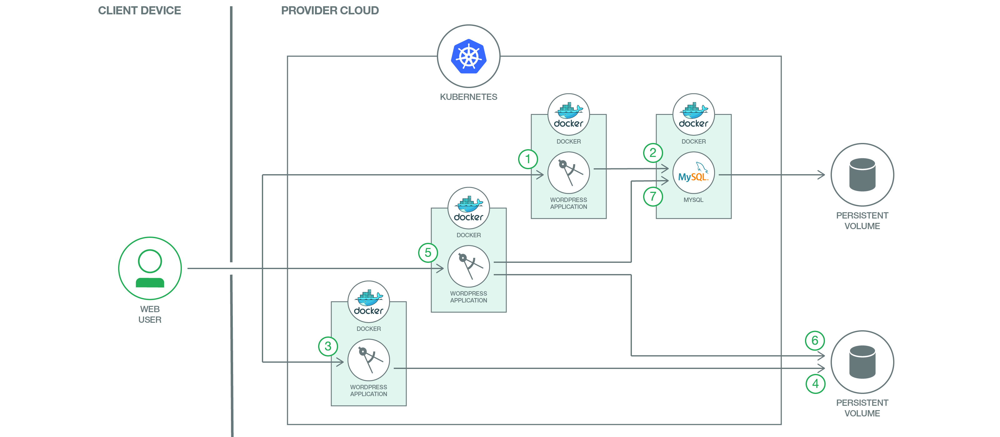
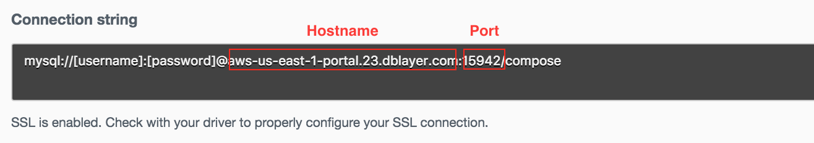
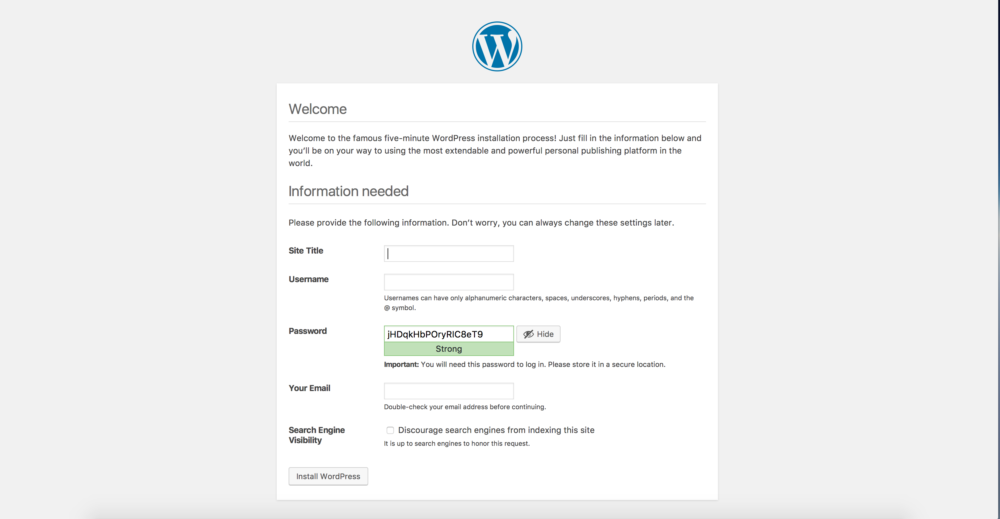
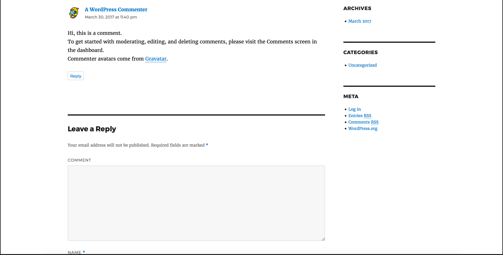

[](https://travis-ci.org/IBM/Scalable-WordPress-deployment-on-Kubernetes)

*Ler em outros idiomas: [한국어](README-ko.md).*

# Implementação escalável do WordPress no Cluster Kubernetes

Esta jornada apresenta toda a força dos clusters Kubernetes e mostra como podemos implementar a estrutura de website mais popular do mundo na plataforma de orquestração de contêineres mais popular do mundo. Fornecemos um roteiro completo para hospedar o WordPress em um Cluster Kubernetes. Cada componente é executado em um contêiner ou grupo de contêineres separado.

O WordPress representa um aplicativo típico multicamada; cada componente terá seus próprios contêineres. Os contêineres do WordPress serão a camada de front-end; o contêiner do MySQL será a camada de banco de dados/backend para o WordPress. A

lém da implementação no Kubernetes, mostraremos como é possível ajustar a escala da camada frontal do WordPress e como o MySQL pode ser utilizado como um serviço do Bluemix para uso pelo front-end do WordPress.



## Componentes inclusos
- [WordPress (mais recente)](https://hub.docker.com/_/wordpress/)
- [MySQL (5.6)](https://hub.docker.com/_/mysql/)
- [Clusters Kubernetes](https://console.ng.bluemix.net/docs/containers/cs_ov.html#cs_ov)
- [Bluemix Container Service](https://console.ng.bluemix.net/catalog/?taxonomyNavigation=apps&amp;category=containers)
- [Bluemix Compose for MySQL](https://console.ng.bluemix.net/catalog/services/compose-for-mysql)
- [Bluemix DevOps Toolchain Service](https://console.ng.bluemix.net/catalog/services/continuous-delivery)

## Pré-requisito

Crie um cluster Kubernetes com [Minikube](https://kubernetes.io/docs/getting-started-guides/minikube) para testes locais ou com o [IBM Bluemix Container Service](https://github.com/IBM/container-journey-template) para implementação na cloud. O código é testado regularmente com relação ao [Cluster Kubernetes do Bluemix Container Service](https://console.ng.bluemix.net/docs/containers/cs_ov.html#cs_ov) usando Travis.

## Objetivos

Este cenário fornece instruções para as tarefas a seguir: - Criar volumes persistentes locais para definir discos persistentes. - Criar um segredo para proteger dados sensíveis. - Criar e implementar o front-end do WordPress com um ou mais pods. - Criar e implementar o banco de dados do MySQL (em um contêiner ou usando o Bluemix MySQL como backend).

## Implementar no Bluemix

Se quiser implementar o WordPress diretamente no Bluemix, clique no botão 'Deploy to Bluemix' abaixo para criar uma cadeia de ferramentas de serviço do Bluemix DevOps e um canal para implementação da amostra do WordPress ou avance para [Etapas](##steps)

[](https://console.ng.bluemix.net/devops/setup/deploy/)

Siga as [instruções da cadeia de ferramentas](https://github.com/IBM/container-journey-template/blob/master/Toolchain_Instructions_new.md) para concluir a cadeia de ferramentas e o canal.

## Etapas
1. [Configurar segredos do MySQL](#1-setup-mysql-secrets)
2. [Criar serviços e implementações para WordPress e MySQL](#2-create-services-and-deployments-for-wordpress-and-mysql)
- 2.1 [Usando o MySQL no contêiner](#21-using-mysql-in-container)
- 2.2 [Usando o Bluemix MySQL](#22-using-bluemix-mysql-as-backend)
3. [Acessando o link externo do WordPress](#3-accessing-the-external-wordpress-link)
4. [Usando o WordPress](#4-using-wordpress)

# 1. Configurar segredos do MySQL

> *Opção de iniciação rápida:* Neste repositório, execute `bash scripts/quickstart.sh`.

Crie um novo arquivo chamado `password.txt` no mesmo diretório e coloque a senha desejada do MySQL em `password.txt` (pode ser qualquer cadeia de caractere com caracteres ASCII).

Precisamos ter certeza de que `password.txt` não contém nenhuma linha nova posterior. Utilize o comando a seguir para remover possíveis linhas novas.
```bash
tr -d '\n' <password.txt >.strippedpassword.txt &amp;&amp; mv .strippedpassword.txt password.txt
```

# 2. Criar serviços e implementações para WordPress e MySQL

### 2.1 Usando o MySQL no contêiner
> *Observação:* se quiser usar o Bluemix Compose-MySql como backend, acesse [Usando o Bluemix MySQL como backend](#22-using-bluemix-mysql-as-backend).

Instale o volume persistente no armazenamento local do cluster. Em seguida, crie o segredo e serviços para MySQL e WordPress.

```bash
kubectl create -f local-volumes.yaml kubectl create secret generic mysql-pass --from-file=password.txt kubectl create -f mysql-deployment.yaml kubectl create -f wordpress-deployment.yaml
```

Quando todos os pods estiverem em execução, execute os comandos a seguir para verificar os nomes deles.

```bash
kubectl get pods
```
Isso deve gerar uma lista de pods a partir do cluster Kubernetes.
```bash
NAME READY STATUS RESTARTS AGE wordpress-3772071710-58mmd 1/1 Running 0 17s wordpress-mysql-2569670970-bd07b 1/1 Running 0 1m
```
 Agora, prossiga para [Acessando o link externo](#3-accessing-the-external-link).

### 2.2 Usando o Bluemix MySQL como backend

Provision Compose for MySQL no Bluemix por meio de https://console.ng.bluemix.net/catalog/services/compose-for-mysql


Acesse as credenciais de serviço e visualize suas credenciais. O nome do host, porta, usuário e senha do MySQL estão na URI da credencial e devem ter esta aparência:



Modifique o arquivo `wordpress-deployment.yaml`, altere o valor WORDPRESS_DB_HOST para o nome do host e a porta do MySQL (ou seja, `value: <hostname>:<port>`), o valor WORDPRESS_DB_USER para o usuário do MySQL e o valor WORDPRESS_DB_PASSWORD para a senha do MySQL.

As variáveis de ambiente devem ter esta aparência:

```yaml
spec: containers: - image: wordpress:4.7.3-apache name: wordpress env: - name: WORDPRESS_DB_HOST value: sl-us-dal-9-portal.7.dblayer.com:22412 - name: WORDPRESS_DB_USER value: admin - name: WORDPRESS_DB_PASSWORD value: XMRXTOXTDWOOPXEE
```
Depois de modificar o `wordpress-deployment.yaml`, execute os comandos a seguir para implementar o WordPress.

```bash
kubectl create -f local-volumes.yaml kubectl create -f wordpress-deployment.yaml ``` Quando todos os pods estiverem em execução, execute os comandos a seguir para verificar os nomes deles. ```bash kubectl get pods
```
Isso deve gerar uma lista de pods a partir do cluster Kubernetes.
```bash
NAME READY STATUS RESTARTS AGE wordpress-3772071710-58mmd 1/1 Running 0 17s
```


# 3. Acessando o link externo do WordPress

> Se tiver um cluster pago, será possível usar o LoadBalancer em vez do NodePort executando
> >`kubectl edit services wordpress`

> > Em `spec`, altere `type: NodePort` para `type: LoadBalancer`

> > **Observação:** confira se `service "wordpress" edited` é exibido após a edição do arquivo yaml, porque isso significa que o arquivo yaml foi editado com sucesso, sem erros tipográficos ou de conexão.

Para obter o endereço IP do cluster, utilize
```bash
 $ bx cs workers <your_cluster_name>
OK
ID                                                 Public IP        Private IP Machine   Type   State   Status
kube-hou02-pa817264f1244245d38c4de72fffd527ca-w1   169.47.220.142   10.10.10.57          free   normal   Ready
```
 Você também precisará executar o comando a seguir para obter o número NodePort.
 ```bash
 $ kubectl get svc wordpress NAME CLUSTER-IP EXTERNAL-IP PORT(S) AGE wordpress 10.10.10.57   <nodes>       80:30180/TCP 2m
 ```
 Parabéns. Agora, você pode usar o link **http://[IP]:[número da porta]** para acessar seu site no WordPress.
 > **Observação:** para o exemplo acima, o link seria http://169.47.220.142:30180 É possível verificar o status da implementação na interface com o usuário do Kubernetes.

 Execute `kubectl proxy` e acesse a URL 'http://127.0.0.1:8001/ui' para verificar quando o contêiner do WordPress ficará pronto.

 

 >**Observação:** os pods podem levar até cinco minutos para começar a funcionar por completo.

 **(Opcional)** Se você tiver mais recursos no cluster e quiser aumentar a capacidade do website do WordPress, poderá executar os comandos a seguir para verificar as implementações atuais.
 ```bash
 $ kubectl get deployments
 NAME        DESIRED   CURRENT   UP-TO-DATE        AVAILABLE   AGE
 wordpress   1 1 1 1   23h       wordpress-mysql   1 1 1 1     23h
 ```
 Agora, é possível usar os comandos a seguir para aumentar a capacidade para o front-end do WordPress.
 ```bash
 $ kubectl scale deployments/wordpress --replicas=2 deployment "wordpress" scaled
 $ kubectl get deployments
 NAME        DESIRED   CURRENT   UP-TO-DATE        AVAILABLE   AGE
 wordpress   2 2 2 2   23h       wordpress-mysql   1 1 1 1     23h
 ```
 Como pode ser visto, temos dois pods que estão em execução no front-end do WordPress. > **Observação:** caso você seja um usuário de camada gratuita, recomendamos aumentar a capacidade para apenas 10 pods, uma vez que os usuários de camada gratuita têm recursos limitados.

# 4. Usando o WordPress
Com o WordPress em execução, é possível se inscrever como novo usuário e instalar o WordPress.



Depois de instalar o WordPress, você poderá publicar novos comentários.



# Resolução de problemas
Caso tenha criado acidentalmente uma senha com linhas novas e não consiga autorizar o serviço do MySQL, você pode excluir o segredo atual usando
```bash
kubectl delete secret mysql-pass
```
Se quiser excluir seus serviços, implementações e a solicitação de volume persistente, você poderá executar
```bash
kubectl delete deployment,service,pvc -l app=wordpress
```
Para excluir seu volume persistente, é possível executar os comandos a seguir
```bash
kubectl delete -f local-volumes.yaml
```


# Referências
- Este exemplo do WordPress baseia-se no exemplo de software livre do Kubernetes [mysql-wordpress-pd](https://github.com/kubernetes/kubernetes/tree/master/examples/mysql-wordpress-pd) em https://github.com/kubernetes/kubernetes/tree/master/examples/mysql-wordpress-pd.
# Licença
[Apache 2.0](LICENÇA)
