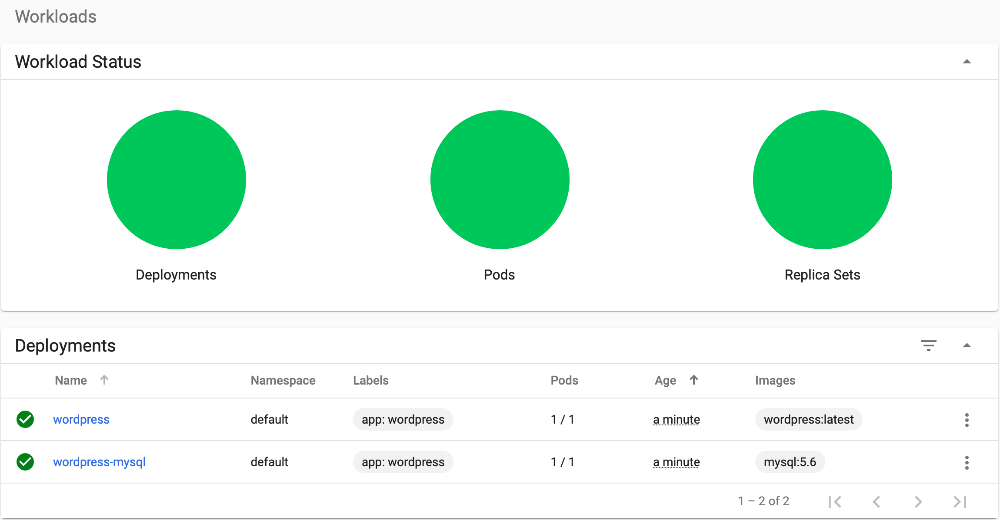
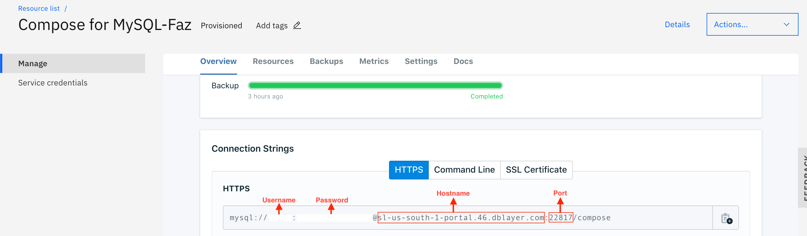

[](https://travis-ci.org/IBM/Scalable-WordPress-deployment-on-Kubernetes)

# Scalable WordPress deployment on Kubernetes Cluster

This journey showcases the full power of Kubernetes clusters and shows how can we deploy the world's most popular website framework on top of world's most popular container orchestration platform. We provide a full roadmap for hosting WordPress on a Kubernetes Cluster. Each component runs in a separate container or group of containers.

WordPress represents a typical multi-tier app and each component will have its own container(s). The WordPress containers will be the frontend tier and the MySQL container will be the database/backend tier for WordPress.

In addition to deployment on Kubernetes, we will also show how you can scale the front WordPress tier, as well as how you can use MySQL as a service from IBM Cloud to be used by WordPress frontend.


## Included Components
- [WordPress (Latest)](https://hub.docker.com/_/wordpress/)
- [MySQL (5.6)](https://hub.docker.com/_/mysql/)
- [Kubernetes Clusters](https://cloud.ibm.com/docs/containers/cs_ov.html#cs_ov)
- [IBM Cloud Compose for MySQL](https://cloud.ibm.com/catalog/services/compose-for-mysql)

## Prerequisite

Create a Kubernetes cluster with either [Minikube](https://kubernetes.io/docs/setup/minikube/) for local testing, with [IBM Cloud Container Service](https://github.com/IBM/container-journey-template), or [IBM Cloud Private](https://github.com/IBM/deploy-ibm-cloud-private/blob/master/README.md) to deploy in cloud. The code here is regularly tested against [Kubernetes Cluster from IBM Cloud Container Service](https://cloud.ibm.com/docs/containers/cs_ov.html#cs_ov) using Travis.

## Objectives

This scenario provides instructions for the following tasks:

- Create local persistent volumes to define persistent disks.
- Create a secret to protect sensitive data.
- Create and deploy the WordPress frontend with one or more pods.
- Create and deploy the MySQL database (either in a container or using IBM Cloud MySQL as backend).

## Deply to IBM Cloud

If you want to deploy the WordPress directly to IBM Cloud, click on `Deploy to IBM Cloud` button below to create an IBM Cloud DevOps service toolchain and pipeline for deploying the WordPress sample, else jump to [steps](##Methods-to-Deploy)

[](https://cloud.ibm.com/devops/setup/deploy?repository=https://github.com/IBM/Scalable-WordPress-deployment-on-Kubernetes&branch=master)

# Methods to Deploy

- [Using The Kustomization File](#Using-The-Kustomization-File)
- [Manually deploying each file](#Manually-deploying-each-deployment)
- [Using Compose for MySQL as Backend](#Using-IBM-Cloud-Compose-for-MySQL-as-backend)

# Using The Kustomization File

`kustomize` lets you customize raw, template-free YAML
files for multiple purposes, leaving the original YAML
untouched and usable as is.

Create a new file called `password.txt` in the same directory and put your desired MySQL password inside `password.txt` (Could be any string with ASCII characters).

How does our `kustomization.yaml` file looks like:

```yaml
secretGenerator: #generates secrets within the cluster
- name: mysql-pass
  files:
  - password.txt
resources: #runs the .yaml files which are written below
  - local-volumes.yaml
  - mysql-deployment.yaml
  - wordpress-deployment.yaml
```
#### To run the kustomization file 

```bash
kubectl apply -k ./
```

#### Output

```bash
secret/mysql-pass-c2f8979ct6 created
service/wordpress-mysql created
service/wordpress created
deployment.apps/wordpress-mysql created
deployment.apps/wordpress created
persistentvolume/local-volume-1 created
persistentvolume/local-volume-2 created
persistentvolumeclaim/mysql-pv-claim created
persistentvolumeclaim/wp-pv-claim created
```


[To read more about kustomization please click here](https://github.com/kubernetes-sigs/kustomize)

Now please move on to [Accessing the External Link](#Accessing-the-external-wordpress-link).

#### To remove the deployment

```bash
kubectl delete -k ./
```

# Manually deploying each deployment
1. [Setup MySQL Secrets](#1-setup-mysql-secrets)
2. [Create local persistent volumes](#2-create-local-persistent-volumes)
3. [Create Services and Deployments for WordPress and MySQL](#3-create-services-and-deployments-for-wordpress-and-mysql)
4. [Accessing the external WordPress link](#Accessing-the-external-wordpress-link)
5. [Using WordPress](#5-using-wordpress)

### 1. Setup MySQL Secrets

Create a new file called `password.txt` in the same directory and put your desired MySQL password inside `password.txt` (Could be any string with ASCII characters).


We need to make sure `password.txt` does not have any trailing newline. Use the following command to remove possible newlines.

```bash
tr -d '\n' <password.txt >.strippedpassword.txt && mv .strippedpassword.txt password.txt
```

### 2. Create Local Persistent Volumes
To save your data beyond the lifecycle of a Kubernetes pod, you will want to create persistent volumes for your MySQL and Wordpress applications to attach to.

#### For "lite" IBM Cloud Kubernetes Service
Create the local persistent volumes manually by running
```bash
kubectl create -f local-volumes.yaml
```
#### For paid IBM Cloud Kubernetes Service OR Minikube
Persistent volumes are created dynamically for you when the MySQL and Wordpress applications are deployed. No action is needed.

### 3. Create Services and deployments for WordPress and MySQL

> *Note:* If you want to use IBM Cloud Compose for MySql as your backend, please go to [Using IBM Cloud MySQL as backend](#Using-IBM-Cloud-MySQL-as-backend).

Install persistent volume on your cluster's local storage. Then, create the secret and services for MySQL and WordPress.

```bash
kubectl create secret generic mysql-pass --from-file=password.txt
kubectl create -f mysql-deployment.yaml
kubectl create -f wordpress-deployment.yaml
```


When all your pods are running, run the following commands to check your pod names.

```bash
kubectl get pods
```

This should return a list of pods from the kubernetes cluster.

```bash
NAME                               READY     STATUS    RESTARTS   AGE
wordpress-3772071710-58mmd         1/1       Running   0          17s
wordpress-mysql-2569670970-bd07b   1/1       Running   0          1m
```

Now please move on to [Accessing the External Link](#Accessing-the-external-wordpress-link).

# Using IBM Cloud Compose for MySQL as backend

### Create Local Persistent Volumes
To save your data beyond the lifecycle of a Kubernetes pod, you will want to create persistent volumes for your Wordpress applications to attach to.

#### For "lite" IBM Cloud Kubernetes Service
Create the local persistent volumes manually by running
```bash
kubectl create -f local-volumes-compose.yaml
```
#### For paid IBM Cloud Kubernetes Service OR Minikube
Persistent volumes are created dynamically for you when the MySQL and Wordpress applications are deployed. No action is needed.

Provision Compose for MySQL in IBM Cloud via https://cloud.ibm.com/catalog/services/compose-for-mysql

Go to Service credentials and view your credentials (or add one if you don't see one created already). Your MySQL hostname, port, user, and password are under your credential url and it should look like this

```script
db_type": "mysql",
  "uri_cli_1": "mysql -u <<USERNAME>> -p<<PASSWORD>> --host sl-us-south-1-portal.47.dblayer.com --port 22817 --ssl-mode=REQUIRED",
```

**Alternatively** you could also go to the manage tab and under "Connection Strings" you will be able to find the username, password, hostname as well as the port as shown below



Go to your `wordpress-deployment-compose.yaml` file, change WORDPRESS_DB_HOST's value to your MySQL hostname and port (i.e. `value: <hostname>:<port>`), WORDPRESS_DB_USER's value to your MySQL user, and WORDPRESS_DB_PASSWORD's value to your MySQL password.

And the environment variables should look like this

```yaml
    spec:
      containers:
      - image: wordpress:latest
        name: wordpress-c
        env:
        - name: WORDPRESS_DB_HOST
          value: <<ENTER YOUR DB HOST>>:<<ENTER DB PORT>>
        - name: WORDPRESS_DB_USER
          value: <<ENTER YOUR DB USERNAME>>
        - name: WORDPRESS_DB_PASSWORD
          value: <<ENTER YOUR DB PASSWORD FROM COMPOSE>>
```


After you modified the `wordpress-deployment-compose.yaml`, run the following commands to deploy WordPress.

```bash
kubectl create -f wordpress-deployment-compose.yaml
```

When all your pods are running, run the following commands to check your pod names.

```bash
kubectl get pods
```

This should return a list of pods from the kubernetes cluster.

```bash
NAME                               READY     STATUS    RESTARTS   AGE
wordpress-3772071710-58mmd         1/1       Running   0          17s
```
#### To access the service

You can obtain your cluster's IP address using

```bash
$ ibmcloud ks workers --cluster <your_cluster_name>
OK
ID                                                 Public IP        Private IP     Machine Type   State    Status
kube-hou02-pa817264f1244245d38c4de72fffd527ca-w1   169.47.220.142   10.10.10.57    free           normal   Ready
```

You will also need to run the following command to get your NodePort number.

```bash
$ kubectl get svc wordpress-c
NAME          TYPE       CLUSTER-IP       EXTERNAL-IP   PORT(S)        AGE
wordpress-c   NodePort   172.21.179.176   <none>        80:30126/TCP   21s
```

Congratulations. Now you can use the link **http://[IP of worker node]:[service port number]** to access your WordPress site.


> **Note:** For the above example, the link would be http://169.47.220.142:30126

### To delete your deployment 

````bash
kubectl delete -f wordpress-deployment-compose.yaml
kubectl delete -f local-volumes-compose.yaml
````
# Accessing the external WordPress link

> If you have a paid cluster, you can use LoadBalancer instead of NodePort by running
>
>`kubectl edit services wordpress`
>
> Under `spec`, change `type: NodePort` to `type: LoadBalancer`
>
> **Note:** Make sure you have `service "wordpress" edited` shown after editing the yaml file because that means the yaml file is successfully edited without any typo or connection errors.

You can obtain your cluster's IP address using

```bash
$ ibmcloud ks workers --cluster <your_cluster_name>
OK
ID                                                 Public IP        Private IP     Machine Type   State    Status
kube-hou02-pa817264f1244245d38c4de72fffd527ca-w1   169.47.220.142   10.10.10.57    free           normal   Ready
```

You will also need to run the following command to get your NodePort number.

```bash
$ kubectl get svc wordpress
NAME        CLUSTER-IP    EXTERNAL-IP   PORT(S)        AGE
wordpress   10.10.10.57   <nodes>       80:30180/TCP   2m
```

Congratulations. Now you can use the link **http://[IP of worker node]:[service port number]** to access your WordPress site.


> **Note:** For the above example, the link would be http://169.47.220.142:30180

You can check the status of your deployment on Kubernetes UI. Run `kubectl proxy` and go to URL 'http://127.0.0.1:8001/ui' to check when the WordPress container becomes ready.


> **Note:** It can take up to 5 minutes for the pods to be fully functioning.


**(Optional)** If you have more resources in your cluster, and you want to scale up your WordPress website, you can run the following commands to check your current deployments.
```bash
$ kubectl get deployments
NAME              DESIRED   CURRENT   UP-TO-DATE   AVAILABLE   AGE
wordpress         1         1         1            1           23h
wordpress-mysql   1         1         1            1           23h
```
# To Scale Your Application

Now, you can run the following commands to scale up for WordPress frontend.
```bash
$ kubectl scale deployments/wordpress --replicas=2
deployment "wordpress" scaled
```

#### Check your added replica
```bash
$ kubectl get deployments
NAME              DESIRED   CURRENT   UP-TO-DATE   AVAILABLE   AGE
wordpress         2         2         2            2           23h
wordpress-mysql   1         1         1            1           23h
```
As you can see, we now have 2 pods that are running the WordPress frontend.

> **Note:** If you are a free tier user, we recommend you only scale up to 10 pods since free tier users have limited resources.

# 5. Using WordPress

Now that WordPress is running you can register as a new user and install WordPress.


After installing WordPress, you can post new comments.


# Troubleshooting

If you accidentally created a password with newlines and you can not authorize your MySQL service, you can delete your current secret using

```bash
kubectl delete secret mysql-pass
```

If you want to delete your services, deployments, and persistent volume claim, you can run
```bash
kubectl delete deployment,service,pvc -l app=wordpress
```

If you want to delete your persistent volume, you can run the following commands
```bash
kubectl delete -f local-volumes.yaml
```

If WordPress is taking a long time, you can debug it by inspecting the logs
```bash
kubectl get pods # Get the name of the wordpress pod
kubectl logs [wordpress pod name]
```


# References
- This WordPress example is based on Kubernetes's open source example [mysql-wordpress-pd](https://github.com/kubernetes/kubernetes/tree/master/examples/mysql-wordpress-pd) at https://github.com/kubernetes/kubernetes/tree/master/examples/mysql-wordpress-pd.


## License
This code pattern is licensed under the Apache Software License, Version 2.  Separate third-party code objects invoked within this code pattern are licensed by their respective providers pursuant to their own separate licenses. Contributions are subject to the [Developer Certificate of Origin, Version 1.1](https://developercertificate.org/) and the [Apache License, Version 2](https://www.apache.org/licenses/LICENSE-2.0.txt).

[Apache License FAQ](https://www.apache.org/foundation/license-faq.html#WhatDoesItMEAN)
