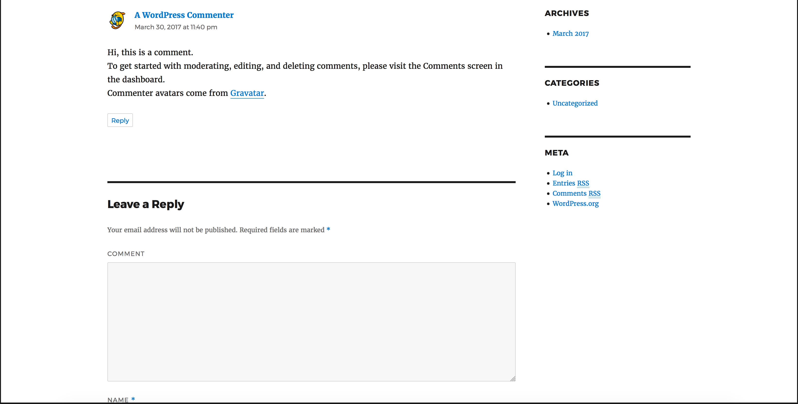

[](https://travis-ci.org/IBM/kubernetes-container-service-scalable-wordpress-deployment)


# Scalable WordPress deployment on Bluemix Container Service using Kubernetes

This project demonstrates how to deploy WordPress and MySQL on Kubernetes cluster with the capability of IBM Bluemix Container Service. The WordPress uses MySQL as the backend and stores sensitive data into the persistent disks.

WordPress represents a typical multi-tier app and each component will have its own container(s). The WordPress containers will be the frontend tier and the MySQL container will be the database/backend tier for WordPress.

With IBM Bluemix Container Service, you can deploy and manage your own Kubernetes cluster in the cloud that lets you automate the deployment, operation, scaling, and monitoring of containerized apps over a cluster of independent compute hosts called worker nodes.


 
## Included Components
- Bluemix container service
- Kubernetes 
- WordPress (Latest)
- MySQL (5.6)

## Prerequisite

Create a Kubernetes cluster with IBM Bluemix Container Service. 

If you have not setup the Kubernetes cluster, please follow the [Creating a Kubernetes cluster](https://github.com/IBM/container-journey-template) tutorial.

## References
- This WordPress example is based on Kubernetes's open source example "mysql-wordpress-pd" at <https://github.com/kubernetes/kubernetes/tree/master/examples/mysql-wordpress-pd>

## Objectives

This scenario provides instructions for the following tasks:

- Create local persistent volumes to define persistent disks.
- Create a secret to protect sensitive data.
- Create and deploy the WordPress frontend with one or more pods.
- Create and deploy the MySQL database(using Bluemix MySQL as backend).

## Deploy to Bluemix
If you want to deploy the wordpress directly to Bluemix, click on 'Deploy to Bluemix' button below to create a Bluemix DevOps service toolchain and pipeline for deploying the WordPress sample, else jump to [Steps](##steps)

[](https://console.ng.bluemix.net/devops/setup/deploy/?repository=https://github.com/IBM/kubernetes-container-service-scalable-wordpress-deployment)

Please follow the [Toolchain instructions](#toolchain-instructions) to complete your toolchain and pipeline.

## Steps
1. [Setup Secrets](#1-setup-secrets)
2. [Create Services and Deployments](#2-create-services-and-deployments)
3. [Accessing the External Link](#3-accessing-the-external-link)
4. [Using WordPress](#4-using-wordpress)

# 1. Setup Secrets

> *Quickstart option:* In this repository, run `bash scripts/quickstart.sh`.

Create a new file called `password.txt` in the same directory and put your desired MySQL password inside `password.txt` (Could be any string with ASCII characters).


We need to make sure `password.txt` does not have any trailing newline. Use the following command to remove possible newlines.

```bash
tr -d '\n' <password.txt >.strippedpassword.txt && mv .strippedpassword.txt password.txt
```

# 2. Create Services and Deployments

> *Note:* If you want to use Bluemix Compose-MySql as your backend, please go to [Using Bluemix MySQL as backend](#21-using-bluemix-mysql-as-backend).

Install persistent volume on your cluster's local storage. Then, create the secret and services for MySQL and WordPress.

```bash
kubectl create -f local-volumes.yaml
kubectl create secret generic mysql-pass --from-file=password.txt
kubectl create -f mysql-deployment.yaml
kubectl create -f wordpress-deployment.yaml
```


When all your pods are running, run the following commands to check your pod names.

```bash
kubectl get pods
```

This should return a list of pods from the kubernetes cluster.

```bash
NAME                               READY     STATUS    RESTARTS   AGE
wordpress-3772071710-58mmd         1/1       Running   0          17s
wordpress-mysql-2569670970-bd07b   1/1       Running   0          1m
```

Now please move on to [Accessing the External Link](#3-accessing-the-external-link).

# 2.1 Using Bluemix MySQL as backend

Provision Compose for MySQL in Bluemix via https://console.ng.bluemix.net/catalog/services/compose-for-mysql

Go to Service credentials and view your credentials. Your MySQL hostname, port, user, and password are under your credential url and it should look like this


Modify your `wordpress-deployment.yaml` file, change WORDPRESS_DB_HOST's value to your MySQL hostname and port(i.e. `value: <hostname>:<port>`), WORDPRESS_DB_USER's value to your MySQL user, and WORDPRESS_DB_PASSWORD's value to your MySQL password.

And the environment variables should look like this

```yaml
    spec:
      containers:
      - image: wordpress:4.7.3-apache
        name: wordpress
        env:
        - name: WORDPRESS_DB_HOST
          value: sl-us-dal-9-portal.7.dblayer.com:22412
        - name: WORDPRESS_DB_USER
          value: admin
        - name: WORDPRESS_DB_PASSWORD
          value: XMRXTOXTDWOOPXEE
```

After you modified the `wordpress-deployment.yaml`, run the following commands to deploy wordpress.

```bash
kubectl create -f local-volumes.yaml
kubectl create -f wordpress-deployment.yaml
```

When all your pods are running, run the following commands to check your pod names.

```bash
kubectl get pods
```

This should return a list of pods from the kubernetes cluster.

```bash
NAME                               READY     STATUS    RESTARTS   AGE
wordpress-3772071710-58mmd         1/1       Running   0          17s
```
    
# 3. Accessing the External Link 

>(Paid Account Only!!) If you have a paid account, you can create a LoadBalancer by running 
>
>`kubectl edit services wordpress`
>
> Under `spec`, change `type: NodePort` to `type: LoadBalancer`
>
> **Note:** Make sure you have `service "wordpress" edited` shown after editing the yaml file because that means the yaml file is successfully edited without any typo or connection errors.

You can obtain your cluster's IP address using

```bash
$ kubectl get nodes
NAME             STATUS    AGE
169.47.220.142   Ready     23h
```

You will also need to run the following command to get your NodePort number.

```bash
$ kubectl get svc wordpress 
NAME        CLUSTER-IP    EXTERNAL-IP   PORT(S)        AGE
wordpress   10.10.10.57   <nodes>       80:30180/TCP   2m
```

Congratulation. Now you can use the link **http://[IP]:[port number]** to access your WordPress site.


> **Note:** For the above example, the link would be http://169.47.220.142:30180

You can check the status of your deployment on Kubernetes UI. Run 'kubectl proxy' and go to URL 'http://127.0.0.1:8001/ui' to check when the WordPress container becomes ready.


> **Note:** It can take up to 5 minutes for the pods to be fully functioning.
    


**(Optional)** If you have more resources in your cluster, and you want to scale up your WordPress website, you can run the following commands to check your current deployments.
```bash
$ kubectl get deployments
NAME              DESIRED   CURRENT   UP-TO-DATE   AVAILABLE   AGE
wordpress         1         1         1            1           23h
wordpress-mysql   1         1         1            1           23h
```

Now, you can run the following commands to scale up for WordPress frontend.
```bash
$ kubectl scale deployments/wordpress --replicas=2
deployment "wordpress" scaled
$ kubectl get deployments
NAME              DESIRED   CURRENT   UP-TO-DATE   AVAILABLE   AGE
wordpress         2         2         2            2           23h
wordpress-mysql   1         1         1            1           23h
```
As you can see, we now have 2 pods that are running the WordPress frontend. 

> **Note:** If you are a free tier user, we recommend you only scale up to 10 pods since free tier users have limited resources.

# 4. Using WordPress

Now that WordPress is running you can register as a new user and install WordPress.


After installing WordPress, you can post new comments.




# Toolchain instructions

> Note: This toolchain instruction is based on this [tutorial](https://developer.ibm.com/recipes/tutorials/deploy-kubernetes-pods-to-the-bluemix-container-service-using-devops-pipelines).

1. Click the Create [toolchain button](https://console.ng.bluemix.net/devops/setup/deploy/?repository=https://github.com/IBM/kubernetes-container-service-scalable-wordpress-deployment) to fork the repo into your GitHub account.

2. If you have not authenticated to GitHub you will see an Authorize button.

3. Once the repository is forked, you will be taken to the Bluemix Continuous Delivery toolchain setup. This toolchain has been defined by the template in the sample repository.

4. Click the Create button. This will generate a toolchain that looks like the following:


5. Select the Delivery Pipeline tile from the toolchain view to open the pipeline stages view.

6. The pipeline executes immediately after being created. The Deploy stage will fail on the first run because we are missing your account information for authentication. Click on the gear at the top right corner of the Deploy stage to select Configure Stage.


7. Set the following environment properties

    BLUEMIX_USER – your Bluemix user ID.
    
    BLUEMIX_PASSWORD – your Bluemix password.
    
    BLUEMIX_ACCOUNT – The GUID of the Bluemix account where you created the cluster. Retrieve it with `bx iam accounts`.
    
    CLUSTER_NAME – Your cluster name. Retrieve it with `bx cs clusters`.  
   


8. Run the Deploy stage using the Run Stage button at the top righthand side of the stage’s card. This time the Deploy stage will succeed and the WordPress sample will be deployed.
    


9. Click **View logs and history** of the Deploy stage to find the URL of the WordPress application.

10. Congratulation, you can click the WordPress link to load the application in your browser. Note it takes a few seconds from the time the pods deploy until they are ready to serve requests.


# Troubleshooting

If you accidentally created a password with newlines and you can not authorize your MySQL service, you can delete your current secret using

```bash
kubectl delete secret mysql-pass
```

If you want to delete your services, deployments, and persistent volume claim, you can run
```bash
kubectl delete deployment,service,pvc -l app=wordpress
```

If you want to delete your persistent volume, you can run the following commands
```bash
kubectl delete pv local-volume-1 local-volume-2
```


# License
[Apache 2.0](LICENSE)
