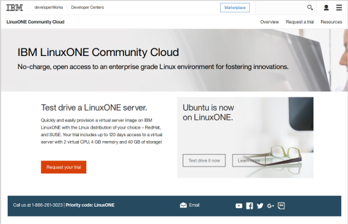
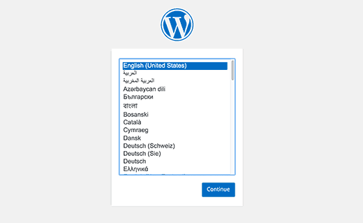

# Deploy with Docker on LinuxONE

Open source software has expanded from a low-cost alternative to a platform for enterprise databases, clouds and next-generation apps. These workloads need higher levels of scalability, security and availability from the underlying hardware infrastructure.

LinuxONE was built for open source so you can harness the agility of the open revolution on the industry’s most secure, scalable and high-performing Linux server. In this journey we will show how to run open source Cloud-Native workloads on LinuxONE

## Included Components

- [LinuxONE](https://www-03.ibm.com/systems/linuxone/open-source/index.html)
- [Docker](https://www.docker.com)
- [Docker Store](https://sore.docker.com)
- [WordPress](https://workpress.com)
- [MariaDB](https://mariadb.org)

## Prerequisites

Register at [LinuxONE Community Cloud](https://developer.ibm.com/linuxone/) for a trial account.
We will be using a Red Hat base image for this journey, so be sure to chose the
red 'Request your trial' button on the lower left side of this page:


## Steps

[Docker Hub](https://hub.docker.com) makes it rather simple to get started with
containers, as there are quite a few images ready for you to use.  You can
browse the list of images that are compatable with LinuxONE by doing a search
on the ['s390x'](https://hub.docker.com/search/?isAutomated=0&isOfficial=0&page=1&pullCount=0&q=s390x&starCount=0) tag.
We will start off with everyone's favorite demo: an installation of WordPress.
These instructions assume a base RHEL 7.2 image.  If you are using Ubuntu,
please follow the separate [instructions](docs/ubuntu.md)

### 1. Install docker
```text
:~$ yum install docker.io
```

### 2. Install docker-compose

Install dependencies

```text
sudo yum install -y python-setuptools
```

Install pip with easy_install

```text
sudo easy_install pip
```

Upgrade backports.ssl_match_hostname

```text
sudo pip install backports.ssl_match_hostname --upgrade
```

Finally, install docker-compose itself
```text
sudo pip install docker-compose
```

### 3. Run and install WordPress

Now that we have docker-compose installed, we will create a `docker-compose.yml`
file.  This will specify a couple of containers from the Docker Store that
have been specifically written for z systems.

```text
vim docker-compose.yml
```

```text
version: '2'

services:

  wordpress:
    image: s390x/wordpress
    ports:
      - 8080:80
    environment:
      WORDPRESS_DB_PASSWORD: example

  mysql:
    image: brunswickheads/mariadb-5.5-s390x
    environment:
      MYSQL_ROOT_PASSWORD: example
```

And finally, run docker-compose (from the same directory you created the `.sh`)

```text
sudo docker-compose up -d
```

After all is installed, you can check the status of your containers
```text
:~$ sudo docker-compose ps
       Name                     Command               State          Ports         
----------------------------------------------------------------------------------
linux1_mysql_1       /docker-entrypoint.sh mysq ...   Up      3306/tcp             
linux1_wordpress_1   /entrypoint.sh apache2-for ...   Up      0.0.0.0:8080->80/tcp
```
and checkout your new blog by using a webbrowser to access 'http://[Your LinuxONE IP Address]:8080'



You will see the default setup screen requesting your language.  The following
screen will ask you to specify a default username/password for the WordPress
installation, after which you will be up and running!
